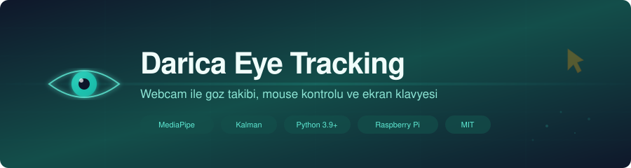
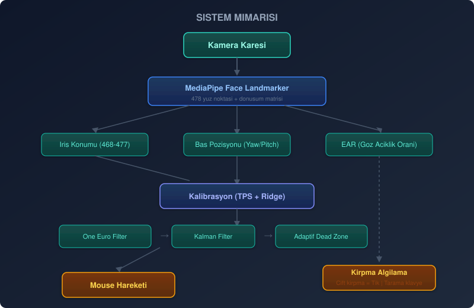

<p align="center">
  
</p>

<p align="center">
  
  
  
  
</p>

---

## What is this?

Eye Tracking tracks your eye movements with a webcam and moves the mouse cursor accordingly. Double-blink to click, or open the scan keyboard and type letter by letter using blinks. A webcam and Python are the only requirements.

Dedicated eye trackers cost a lot, and most people with physical disabilities can't easily get one. I wanted to see how far you could get with a regular webcam, and this is what came out of that.

### What does it do?

<table>
<tr>
<td width="50%">

Gaze tracking
- Mouse control using iris position and head angle
- 13-point calibration, done per user
- TPS + Ridge regression to map gaze direction to screen coordinates
- Kalman and One Euro filters for jitter suppression
- Adaptive dead zone that ignores small movements when you're mostly still

</td>
<td width="50%">

Blink and keyboard
- Double blink works as a left click
- Scan keyboard: blinks advance through letters one by one
- Turkish word prediction while typing
- Adaptive EAR threshold so looking down doesn't count as a blink
- Hold eyes closed for 2 seconds to toggle the keyboard on or off

</td>
</tr>
</table>

## System architecture

<p align="center">
  
</p>

<details>
<summary>Technical details</summary>

<br/>

MediaPipe Face Landmarker pulls 478 landmarks off your face. I grab the iris ones (468-477) and the head transformation matrix, then run Ridge regression and TPS interpolation to turn that into screen coordinates.

Between the raw gaze estimate and the actual cursor, three filters run in sequence. One Euro Filter does low-latency smoothing, Kalman Filter handles noise, and Adaptive Dead Zone throws out tiny jitters when you're mostly holding still. The cursor is reasonably stable after all three, though it's not perfect.

Blink detection uses Eye Aspect Ratio (EAR) with an adaptive threshold. Looking down naturally closes your eyelid a bit, which triggers false positives if you're not careful. I check the iris Y coordinate to avoid that.

</details>

## Setup

You need Python 3.9+, a webcam, and either Windows 10/11 or Raspberry Pi OS.

### Windows

```bash
git clone https://github.com/veyndor1/darica-eyetracking.git
cd darica-eyetracking
pip install -r requirements.txt
```

### Raspberry Pi

```bash
git clone https://github.com/veyndor1/darica-eyetracking.git
cd darica-eyetracking
pip install -r requirements-rpi.txt
```

### MediaPipe model

The model file (`face_landmarker.task`) is in the repo already. If you want a newer version:

```bash
wget -O face_landmarker.task \
  https://storage.googleapis.com/mediapipe-models/face_landmarker/face_landmarker/float16/latest/face_landmarker.task
```

## Usage

```bash
# Windows
python gazetracking.py

# Raspberry Pi
python rasbperrypi.py
```

The program starts with a 13-point calibration screen. Look at each dot, move your head and eyes toward it. After calibration, the cursor follows your gaze.

### Shortcuts

| Key | What it does |
|:---:|------------|
| `q` | Quit |
| `c` | Recalibrate |
| `p` | Toggle mouse control |
| `b` | Toggle clicking |

### Scan keyboard

The scan keyboard opens when you close your eyes for about 2 seconds (same to close it):

| Action | Result |
|--------|--------|
| Single blink | Next letter |
| Double blink | Type selected letter |
| ~1 sec eyes closed | Skip to next row |
| ~2 sec eyes closed | Toggle keyboard |

## Raspberry Pi version

`rasbperrypi.py` uses Picamera2 or V4L2 for camera input, xrandr or tkinter to figure out screen size, and pynput for mouse and keyboard control (you need X11 running). Pi 4 or newer works best since MediaPipe eats CPU.

## Project structure

```
darica-eyetracking/
├── gazetracking.py            # Main app (Windows)
├── rasbperrypi.py             # Raspberry Pi version
├── face_landmarker.task       # MediaPipe face model
├── requirements.txt           # Dependencies (Windows)
├── requirements-rpi.txt       # Dependencies (Raspberry Pi)
├── docs/assets/               # Logo, banner, diagrams
├── CHANGELOG.md               # Version history
└── LICENSE                    # MIT license
```

## License

[MIT](LICENSE)
